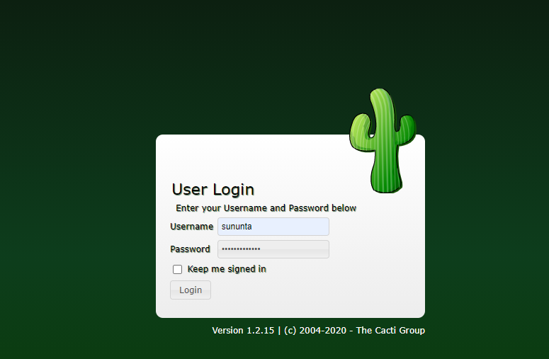
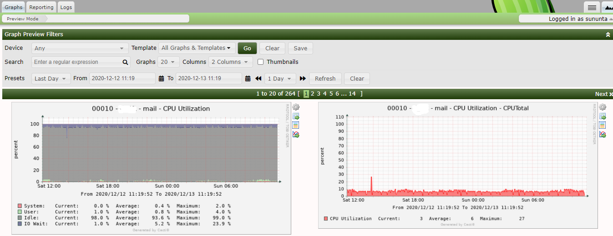
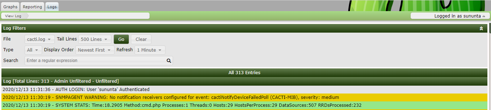

# Authorization of the server resource with Cacti for users

Valid case
1. User Log-in Access Cacti with the feature username and password.

2. Users can view various information with Cacti program according to their own rights. 

Invalid case
1. User Log-in Access Cacti with the feature username and password.

2. Users can view various information with Cacti programs that are not their own right.

--------------------------------------

Members
- Sununta Labaiusuh
- Nattawut Reungsap