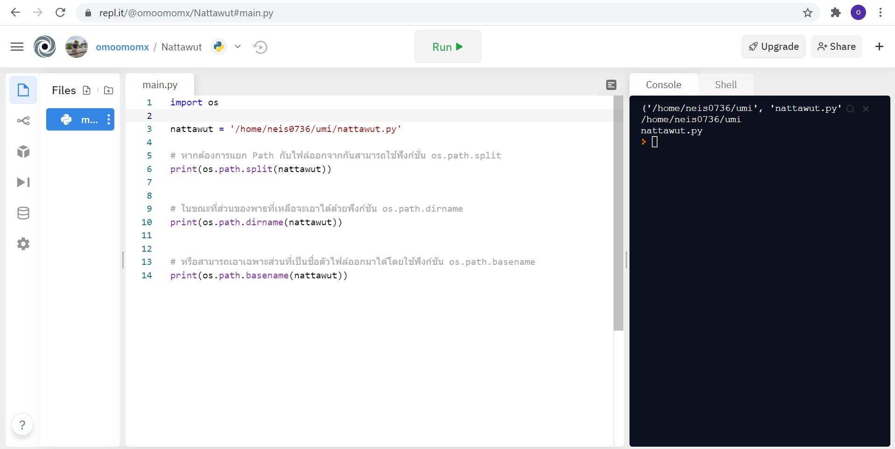

# os.path.basename()

บทความนี้แสดงวิธีการใช้ os.path.basename() ซึ่งเป็น Function ของภาษา Python อยู่ใน Modules ที่ชื่อว่า "OS" เป็น Modules หนึ่งที่มีอยู่ใน Python ตั้งแต่แรก โดยไม่ต้องติดตั้งเพิ่มและมีโอกาสใช้งานบ่อย ภายใน Function นี้มีพวก Function ที่เกี่ยวข้องกับระบบปฏิบัติการ (Operating System : OS) สำหรับจัดการกับ Path ของไฟล์บน OS

### ความแตกต่างระหว่าง Path ใน Windows และ Mac กับ Linux

เนื่องจาก Path ของไฟล์นั้นมีความแตกต่างไปในแต่ละระบบปฏิบัติการ (OS) โดยหลัก ๆ แล้วจะแบ่งออกเป็น 2 แบบ คือ Windows และ Mac กับ Linux ซึ่ง Path ใน Windows จะใช้เครื่องหมาย "\" ในการกั้น ในขณะที่ Mac และ Linux จะใช้เครื่องหมายทับ "/"

ตัวอย่าง Path ใน Windows ยกตัวอย่างเช่น

#### C:\neis0736\nattawut.py

ตัวอย่าง Path ใน Mac หรือ Linux ยกตัวอย่างเช่น

#### /home/neis0736/nattawut.py

ดังนั้น การใช้ Function ต่าง ๆ ใน os.path ทำให้สามารถเขียนโปรแกรมที่สามารถใช้งานได้เหมือนกันทั้งใน Windows และ Mac กับ Linux โดยไม่ต้องมาคอยเขียนแยกกรณี

### การใช้งาน os.path.basename()

หากต้องการเอาเฉพาะส่วนที่เป็นชื่อตัวไฟล์ออกมาได้โดยใช้ Function "os.path.basename" ในขณะที่ส่วนของ Path ที่เหลือจะเอาได้ด้วยฟังก์ชัน Function "os.path.basename" ซึ่งจะแสดงตัวอย่างผ่าน https://repl.it/ เป็น Website ที่ใช้ในการเขียนโปรแกรมแบบ Online และสามารถ Share ให้เพื่อนมาร่วมกันเขียนโปรแกรมได้ และรองรับหลากหลายภาษา

### https://repl.it/

### วิธีการใช้ os.path.basename()
จะไม่แสดง Path ของไฟล์ที่อยู่บนระบบปฏิบัติการ (OS) ซึ่งมีรายละเอียดตามรูปภาพ

## อ้างอิง
- https://phyblas.hinaboshi.com/20200304
- https://repl.it/

--------------------------------------

### Nattawut Reungsap