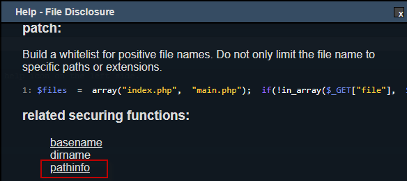

# Directory Traversal

บทความนี้แสดงวิธีการปิดช่องโหว่ Directory Traversal ซึ่งเป็นช่องโหว่ที่สามารถทำให้เราเข้าถึงไฟล์ที่อยู่ในโฟลเดอร์ต่าง ๆ ของระบบปฏิบัติการ (OS) ได้ โดยที่ระบบไม่ได้อนุญาต แต่อาศัยการเดา “Path” และชื่อไฟล์ต่าง ๆ ก็ทำให้สามารถเข้าถึงไฟล์ที่สำคัญของระบบปฏิบัติการ (OS) ได้ ซึ่งมีขั้นตอนในการปิดช่องโหว่ของภาษา PHP ดังนี้

ขั้นตอนที่ 1 : เข้าสู่ bWAPP (ในที่นี้ bWAPP ติดตั้งอยู่บน Virtual Machine)

ขั้นตอนที่ 2 : เลือก "Directory Traversal - Directories" ที่หัวข้อ Choose your bug จากนั้นกดปุ่ม "Hack"

ขั้นตอนที่ 3 : จะปรากฎข้อมูลต่าง ๆ ของระบบตามที่ผู้พัฒนาระบบกำหนดไว้

ขั้นตอนที่ 4 : ทดสอบใส่ "?directory=../../../../../../../" ต่อจากลิงค์ Url ของระบบ ตามรูปภาพ

ขั้นตอนที่ 5 : พบว่าระบบแสดงข้อมูลของระบบปฏิบัติการ (OS) ซึ่งจากข้อมูลที่หลุดออกมาระบุได้ว่าเป็น Linux Server อาจจะเป็นช่องโหว่ของผู้ไม่ประสงค์ดีได้

ขั้นตอนที่ 6 : ใช้โปรแกรม RIPS ที่ติดตั้งไว้แล้วบน Virtual Machine สแกนช่องโหว่ของ Code จากผลลัพธ์ตามรูปภาพ มี 1 ช่องโหว่ ที่เป็น "File Disclosure"

ขั้นตอนที่ 7 : ทำการตรวจสอบบรรทัดของ Code ที่มีช่องโหว่ (ตามรูปภาพ)

ขั้นตอนที่ 8 : กดปุ่ม "get help" เพื่อดูรายละเอียดของช่องโหว่ รวมถึงเลือก Securing Functions เพื่อมาแก้ไขช่องโหว่ดังกล่าว สำหรับบทความนี้เลือก pathinfo 

ขั้นตอนที่ 9 : กดลิงค์ "pathinfo" เพื่อดูตัวอย่างการใช้ Securing Functions จาก www.php.net

ขั้นตอนที่ 10 : ทำการเพิ่ม Securing Functions ตามคำแนะนำของ www.php.net

Code เดิม

Code แก้ไขแล้ว

ขั้นตอนที่ 11 : ใช้ RIPS สแกนช่องโหว่ของ Code อีกครั้ง พบว่าช่องโหว่ "File Disclosure" หายไปแล้ว

ขั้นตอนที่ 11 : ทดสอบใส่ "?directory=../../../../../../../" ต่อจากลิงค์ Url ของระบบอีกครั้ง พบว่าระบบไม่แสดงข้อมูลของระบบปฏิบัติการ (OS)

## อ้างอิง
- www.php.net

--------------------------------------

### Nattawut Reungsap