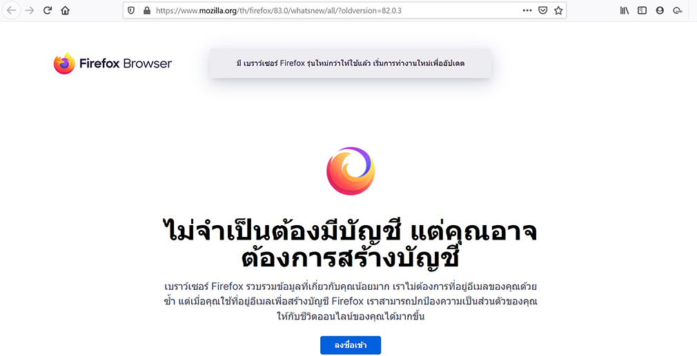
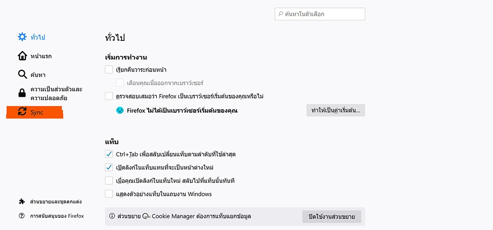
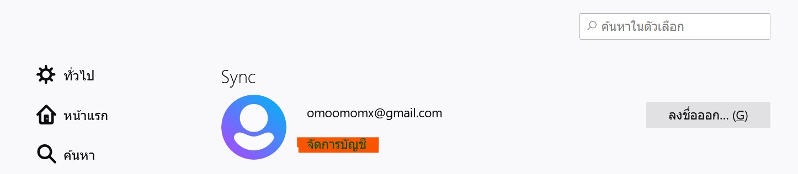
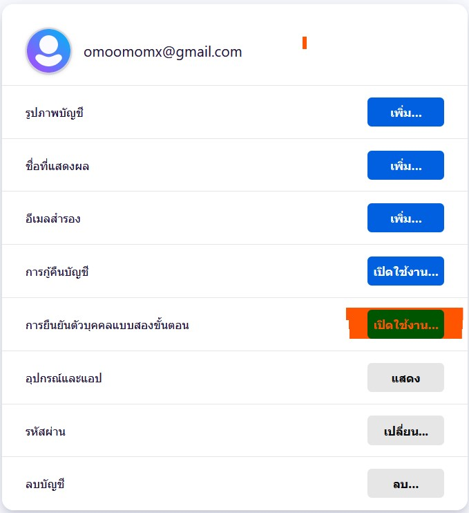
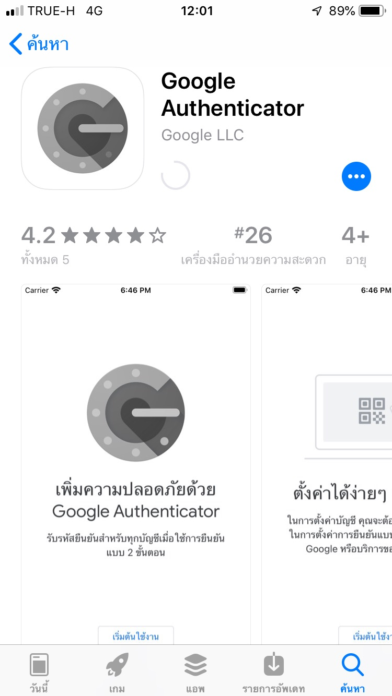
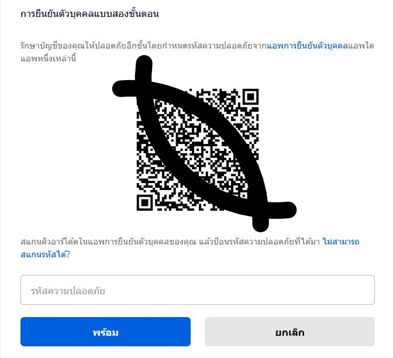
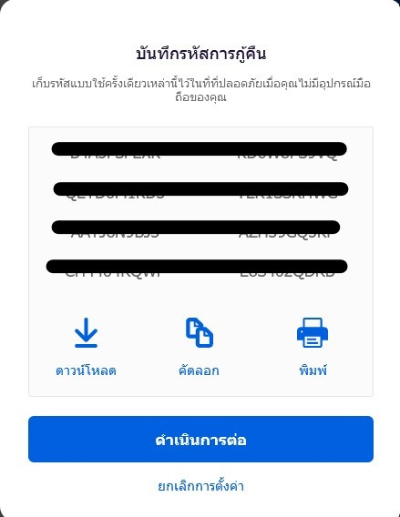
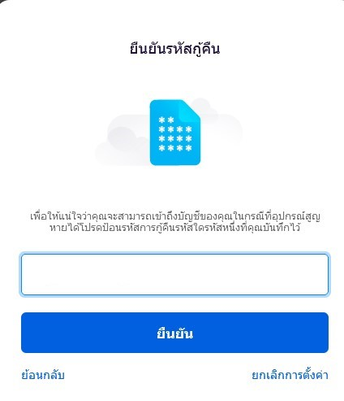
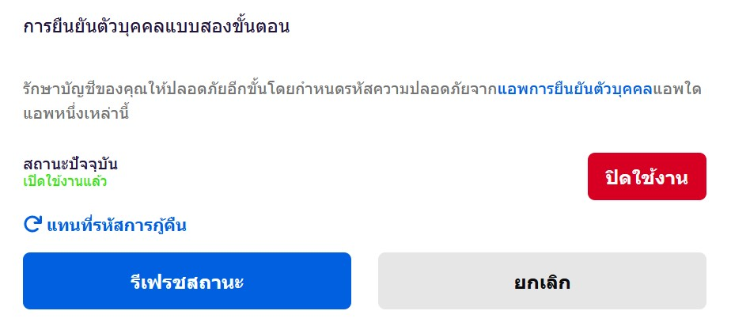

# Two Factor Authentication on Firefox

1. Login Firefox Browser

2. เลือกเมนู "Sync" 

3. เลือกเมนู "จัดการบัญชี"

4. เลือก "เปิดใช้งาน" การยืนยันตัวตนแบบสองขั้นตอน

5. ใช้มือถือโหลดแอป "Google Authenticator"

6. ใช้แอป "Google Authenticator" สแกน QR Code จะได้รับรหัส และนำรหัสที่ได้ไปกรอกในช่องตามภาพ

7. บันทึกรหัสกู้คืนเก็บไว้

8. ทดสอบใส่รหัสกู้คืนที่บันทึกไว้

9. เปิดใช้งานการยืนยันตัวตนแบบสองขั้นตอน เรียบร้อยแล้ว

--------------------------------------

### Members
- Nattawut Reungsap
- Shirassuda Thongpakdhi