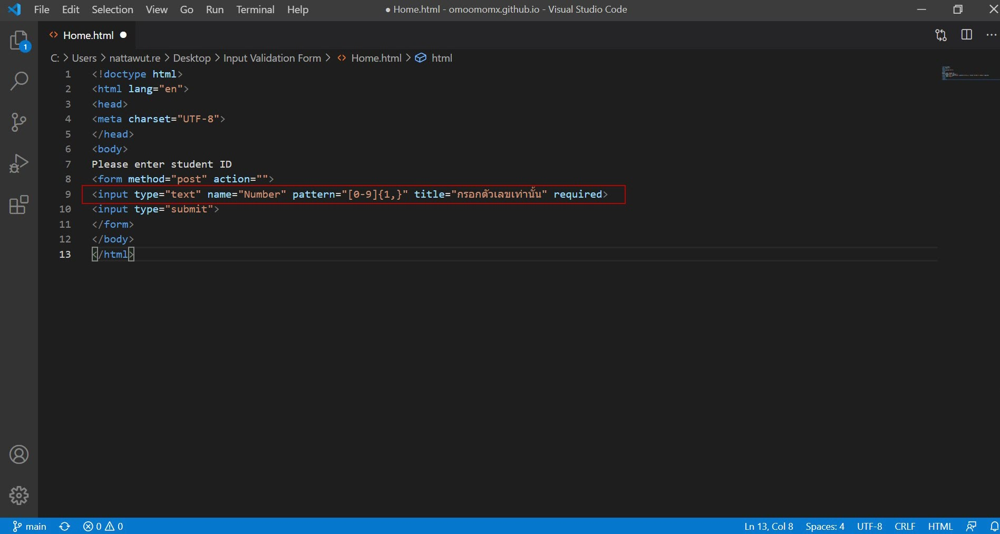
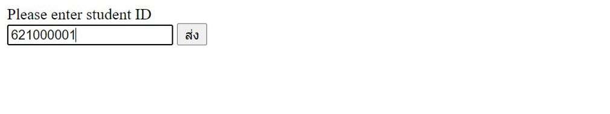

# Input Validation Form

บทความนี้แสดงวิธีการตรวจสอบการรับค่าจากผู้ใช้งานเข้าระบบ เพื่อให้ค่านั้นมีความถูกต้องครบถ้วนตามรูปแบบที่ได้กำหนดเอาไว้ โดยบทความนี้แสดงตัวอย่างง่าย ๆ ในการรับค่ารหัสนักศึกษา ซึ่งเป็นค่า "ตัวเลข" ทั้งหมด เพื่อป้องกันผู้ใช้งานกรอกข้อมูลผิดพลาด และป้องกันผู้ไม่ประสงค์ดีกรอกไม่พึงประสงค์ เช่น Injection, XSS ฯลฯ มีตัวอย่างง่าย ๆ ดังนี้

ขั้นตอนที่ 1 : สร้างหน้าเว็บรับข้อมูลรหัสนักศึกษาขึ้นมา

ขั้นตอนที่ 2 : จะได้หน้าเว็บรับข้อมูลรหัสนักศึกษา ซึ่งสามารถกรอกข้อมูลได้ทั้งตัวเลขและตัวอักษร ทำให้ผู้ใช้งานอาจเกิดความผิดพลาดในการกรอกข้อมูล

ขั้นตอนที่ 3 : ใส่ "patern" ลงไปใน Code เพื่อรับค่าเฉพาะตัวเลขเท่านั้น 

ขั้นตอนที่ 4 : จะได้หน้าเว็บรับข้อมูลรหัสนักศึกษา ซึ่งสามารถกรอกข้อมูลได้เฉพาะตัวเลขเท่านั้น

ขั้นตอนที่ 5 : ทดสอบกรอก "ตัวเลข" ลงในช่องรับข้อมูล พบว่าสามารถบันทึกข้อมูลได้

ขั้นตอนที่ 6 : ทดสอบกรอก "ตัวอักษร" ลงในช่องรับข้อมูล พบว่าไม่สามารถบันทึกข้อมูลได้ และมี Pop Up แจ้งเตือน ""

## อ้างอิง
- https://www.thaicreate.com/php/forum/123416.html

--------------------------------------

### Nattawut Reungsap