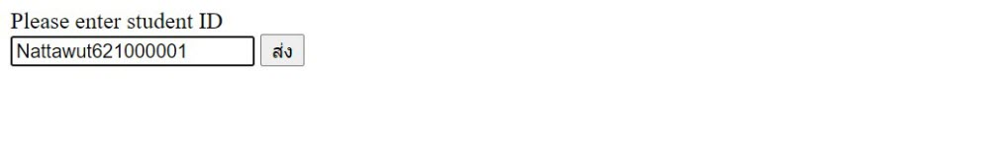

# Input Validation Form

บทความนี้แสดงวิธีการตรวจสอบการรับค่าจากผู้ใช้งาน เพื่อให้ค่านั้นมีความถูกต้องครบถ้วนตามรูปแบบที่ได้กำหนดเอาไว้ โดยบทความนี้แสดงตัวอย่างง่าย ๆ ในการรับค่ารหัสนักศึกษา ซึ่งเป็นค่า "ตัวเลข" ทั้งหมด เพื่อป้องกันผู้ใช้งานกรอกข้อมูลผิดพลาด และป้องกันผู้ไม่ประสงค์ดีกรอกข้อมูลไม่พึงประสงค์เข้ามา ยกตัวอย่างเช่น Injection, XSS ฯลฯ ซึ่งมีตัวอย่างง่าย ๆ ดังนี้

ขั้นตอนที่ 1 : เขียน Code สร้างหน้าเว็บสำหรับรับข้อมูลรหัสนักศึกษาขึ้นมา

ขั้นตอนที่ 2 : จะได้หน้าเว็บรับข้อมูลรหัสนักศึกษา ซึ่งสามารถกรอกข้อมูลได้ทั้งตัวเลขและตัวอักษร ทำให้ผู้ใช้งานอาจเกิดความผิดพลาดในการกรอกข้อมูลได้

ขั้นตอนที่ 3 : ป้องกันผู้ใช้งานกรอกข้อมูลผิดพลาดด้วยการใส่ "patern" ลงไปใน Code เพื่อรับค่าเฉพาะตัวเลขเท่านั้น 

ขั้นตอนที่ 4 : จะได้หน้าเว็บรับข้อมูลรหัสนักศึกษา ซึ่งสามารถกรอกข้อมูลได้เฉพาะตัวเลขเท่านั้น

ขั้นตอนที่ 5 : ทดสอบกรอก "ตัวเลข" ลงในช่องรับข้อมูลและกดปุ่ม "ส่ง" พบว่าสามารถบันทึกข้อมูลได้

ขั้นตอนที่ 6 : ทดสอบกรอก "ตัวอักษร" ลงในช่องรับข้อมูลและกดปุ่ม "ส่ง" พบว่าไม่สามารถบันทึกข้อมูลได้ และมี Pop Up แจ้งเตือน "กรอกตัวเลขเท่านั้น"

## อ้างอิง
- https://www.thaicreate.com/php/forum/123416.html

--------------------------------------

### Nattawut Reungsap