# OS Command Injection

บทความนี้แสดงวิธีการปิดช่องโหว่ OS Command Injection ซึ่งเป็นช่องโหว่ของระบบที่มีการยินยอมให้ Run Command line บนเครื่อง Server ได้จากฝั่ง Client เช่น ls, cp, rm ฯลฯ บน Linux Server โดยมีขั้นตอน ดังนี้

ขั้นตอนที่ 1 : เข้าสู่ bWAPP (ในที่นี้ bWAPP ติดตั้งอยู่บน Virtual Machine)

ขั้นตอนที่ 2 : เลือก "OS Command Injection" ที่หัวข้อ Choose your bug จากนั้นกดปุ่ม "Hack"

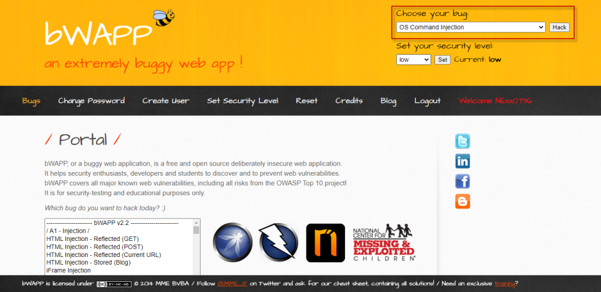

ขั้นตอนที่ 3 : ทดสอบการใช้งานตามฟังก์ชั่นปกติ 

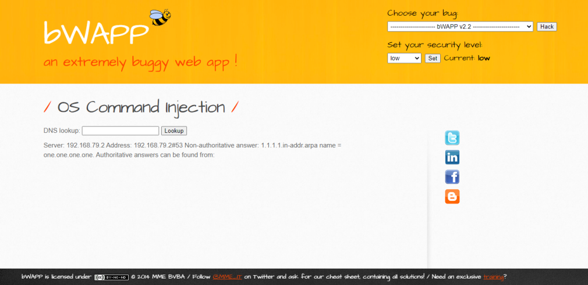

ขั้นตอนที่ 4 : ทดสอบใส่ Command Injection "& ls" พบว่าระบบแสดงข้อมูลของระบบปฏิบัติการ ซึ่งจากข้อมูลที่ออกมาระบุได้ว่าเป็น Linux Server อาจจะเป็นช่องโหว่ของผู้ไม่ประสงค์ดีได้

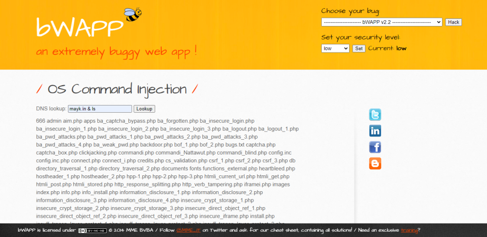

ขั้นตอนที่ 5 : ใช้โปรแกรม RIPS ที่ติดตั้งไว้แล้วบน Virtual Machine สแกนช่องโหว่ของ Code จากผลลัพธ์ตามรูปภาพ มี 1 ช่องโหว่ ที่เป็น "Command Execution"

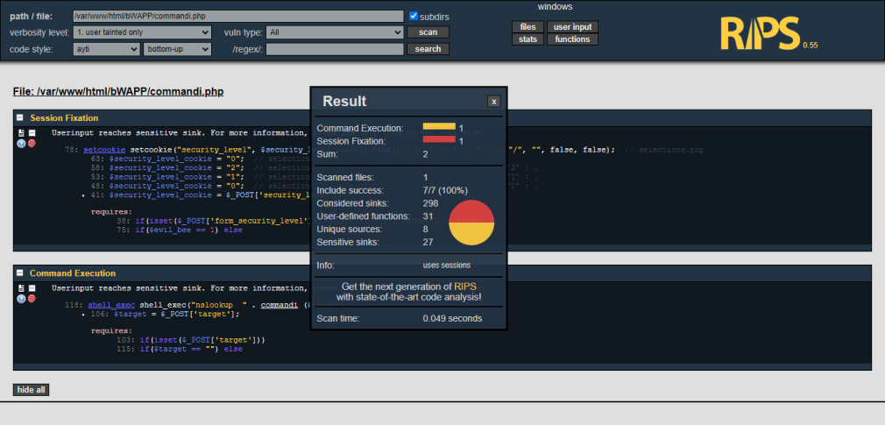

ขั้นตอนที่ 6 : ทำการตรวจสอบบรรทัดที่ 118 ของ Code ที่มีช่องโหว่ (ตามรูปภาพ)

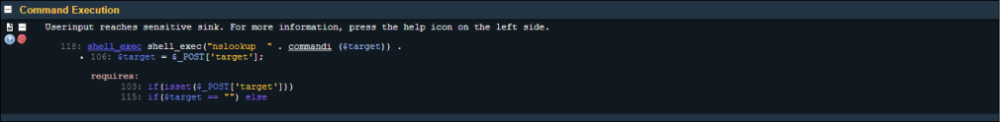

ขั้นตอนที่ 7 : กดปุ่ม "get help" เพื่อดูรายละเอียดของช่องโหว่ รวมถึงเลือก Securing Functions เพื่อมาแก้ไขช่องโหว่ดังกล่าว สำหรับบทความนี้เลือก escapeshellcmd 

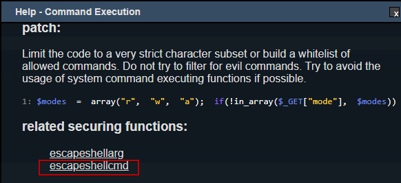

ขั้นตอนที่ 8 : กดลิงค์ "escapeshellcmd" เพื่อดูตัวอย่างการใช้ Securing Functions จาก www.php.net

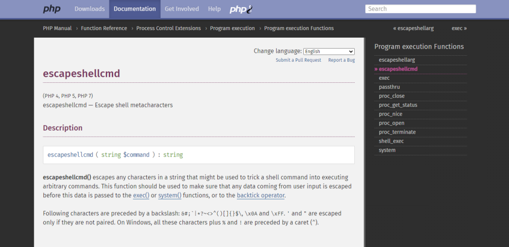

ขั้นตอนที่ 9 : ทำการเพิ่ม Securing Functions ตามคำแนะนำของ www.php.net

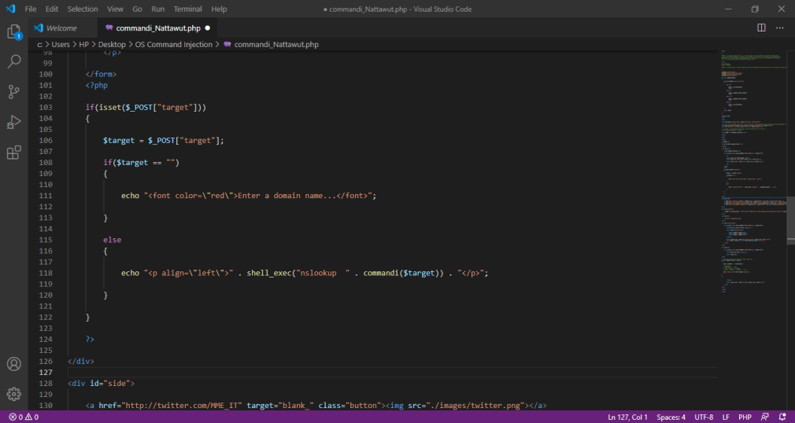

Code เดิม

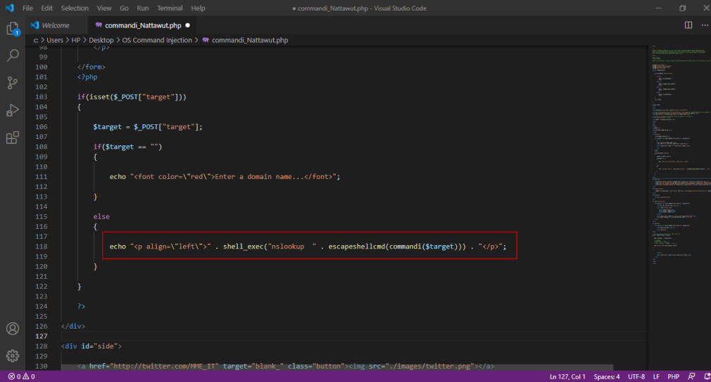

Code แก้ไขแล้ว

ขั้นตอนที่ 10 : ใช้ RIPS สแกนช่องโหว่ของ Code อีกครั้ง

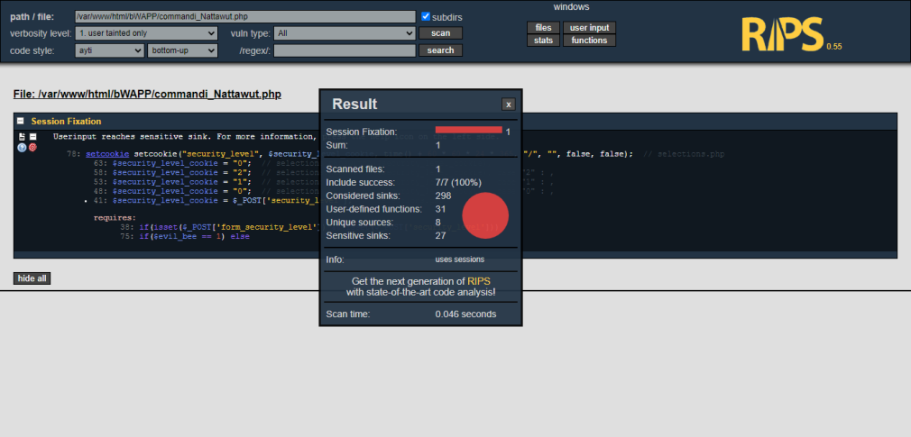

ขั้นตอนที่ 11 : ทดสอบการใช้งานตามฟังก์ชั่นปกติอีกครั้ง เพื่อให้แน่ใจว่าฟังก์ชั่นสามารถทำงานได้ตามปกติ

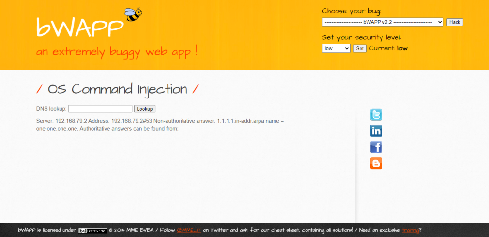

## อ้างอิง
- www.php.net

--------------------------------------

### Nattawut Reungsap