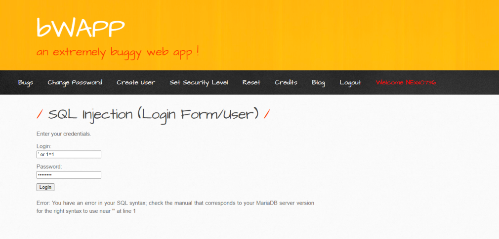
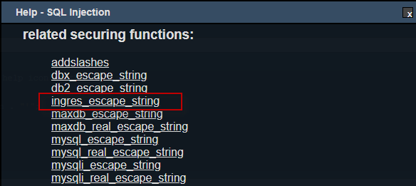

# SQL Injection (Login Form)

บทความนี้แสดงวิธีการปิดช่องโหว่ SQL Injection บนหน้า Login Form ของภาษา PHP ซึ่งแสดงแบบฟอร์มให้ผู้ใช้งานทำการกรอก Username และ Password เพื่อยืนยันตัวตน เมื่อผู้ใช้งานทำการกรอกข้อมูลลงใน login_form.php และกด submit ข้อมูล Username และ Password จะถูกส่งต่อไปที่ไฟล์ login_check.php เพื่อทำการตรวจสอบว่า Username และ Password ที่ส่งมาตรงกับข้อมูลในฐานข้อมูลหรือไม่ โดยทำการส่ง SQL query ไปยังฐานข้อมูล หากฐานข้อมูลตรวจสอบ พบว่า Username และ Password ตรงกับข้อมูลที่เก็บอยู๋ในฐานข้อมูลก็จะทำการแสดงผลว่า login success หาก Username และ Password นั้นถูกต้อง และ login fail หาก Username และ Password ไม่ถูกต้อง

ขั้นตอนที่ 1 : เข้าสู่ bWAPP (ในที่นี้ bWAPP ติดตั้งอยู่บน Virtual Machine)

ขั้นตอนที่ 2 : เลือก "SQL Injection (Login Form/User)" ที่หัวข้อ Choose your bug จากนั้นกดปุ่ม "Hack"

ขั้นตอนที่ 3 : ทดสอบการใช้งานตามฟังก์ชั่นปกติ พบว่าไม่สามารถ Login ได้ หากไม่รู้ Username และ Password

ขั้นตอนที่ 4 : ทดสอบใส่ Command SQL Injection "' or 1=1" พบว่าระบบแสดงข้อมูล Error และเปิดเผยข้อมูลของ Database ซึ่งอาจจะเป็นช่องโหว่ของผู้ไม่ประสงค์ดีได้

ขั้นตอนที่ 5 : ใช้โปรแกรม RIPS ที่ติดตั้งไว้แล้วบน Virtual Machine สแกนช่องโหว่ของ Code จากผลลัพธ์ตามรูปภาพ มี 1 ช่องโหว่ ที่เป็น "SQL Injection"

ขั้นตอนที่ 6 : ทำการตรวจสอบบรรทัดที่ 144 ของ Code ที่มีช่องโหว่ (ตามรูปภาพ)

ขั้นตอนที่ 7 : กดปุ่ม "get help" เพื่อดูรายละเอียดของช่องโหว่ รวมถึงเลือก Securing Functions เพื่อมาแก้ไขช่องโหว่ดังกล่าว สำหรับบทความนี้เลือก ingres_escape_string 

ขั้นตอนที่ 8 : กดลิงค์ "ingres_escape_string" เพื่อดูตัวอย่างการใช้ Securing Functions จาก www.php.net

ขั้นตอนที่ 9 : ทำการเพิ่ม Securing Functions ตามคำแนะนำของ www.php.net

Code เดิม

Code แก้ไขแล้ว

ขั้นตอนที่ 10 : ใช้ RIPS สแกนช่องโหว่ของ Code อีกครั้ง

ขั้นตอนที่ 11 : ทดสอบการใช้งานตามฟังก์ชั่นปกติอีกครั้ง เพื่อให้แน่ใจว่าฟังก์ชั่นสามารถทำงานได้ตามปกติ

ขั้นตอนที่ 12 : ทดสอบใส่ Command SQL Injection "' or 1=1" อีกครั้ง พบว่า ระบบไม่แสดงของ Database

## อ้างอิง
- www.php.net

--------------------------------------

### Nattawut Reungsap