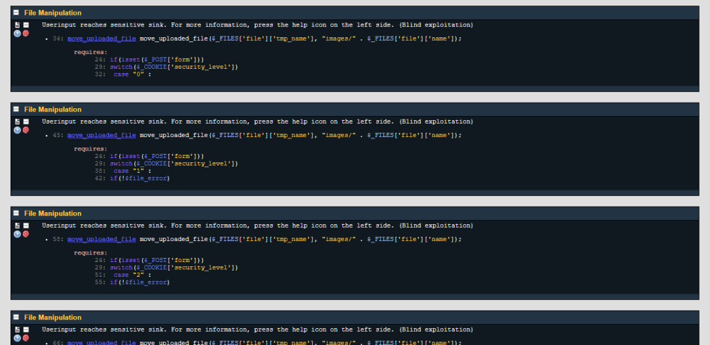

# Unrestricted File Upload

บทความนี้แสดงวิธีการปิดช่องโหว่ Unrestricted File Upload ของภาษา PHP หรือการจำกัดชนิดและขนาดของไฟล์ Upload เพื่อป้องกันการ Upload ไฟล์ขนาดใหญ่ และไฟล์ไม่พึงประสงค์เข้าสู่เครื่อง Server ซึ่งมีวิธีการ ดังนี้

ขั้นตอนที่ 1 : เข้าสู่ bWAPP (ในที่นี้ bWAPP ติดตั้งอยู่บน Virtual Machine)

ขั้นตอนที่ 2 : เลือก "Unrestricted File Upload" ที่หัวข้อ Choose your bug จากนั้นกดปุ่ม "Hack"

ขั้นตอนที่ 3 : ทดสอบการใช้งานตามฟังก์ชั่นปกติ พบว่าสามารถ Upload ไฟล์ได้ไม่จำกัดชนิดและขนาดของไฟล์

ขั้นตอนที่ 4 : ใช้โปรแกรม RIPS ที่ติดตั้งไว้แล้วบน Virtual Machine สแกนช่องโหว่ของ Code จากผลลัพธ์ตามรูปภาพ มี 4 ช่องโหว่ ที่เป็น "File Manipulation"

ขั้นตอนที่ 5 : ทำการตรวจสอบบรรทัดที่ 34, 45, 58 และ 66 ของ Code ที่มีช่องโหว่ (ตามรูปภาพ)

ขั้นตอนที่ 6 : กดปุ่ม "get help" เพื่อดูรายละเอียดของช่องโหว่ รวมถึงเลือก Securing Functions เพื่อมาแก้ไขช่องโหว่ดังกล่าว สำหรับบทความนี้เลือก basename 

ขั้นตอนที่ 7 : กดลิงค์ "basename" เพื่อดูตัวอย่างการใช้ Securing Functions จาก www.php.net

ขั้นตอนที่ 8 : ทำการเพิ่ม Securing Functions ตามคำแนะนำของ www.php.net

Code เดิม

Code แก้ไขแล้ว

ขั้นตอนที่ 9 : ใช้ RIPS สแกนช่องโหว่ของ Code อีกครั้ง

ขั้นตอนที่ 10 : ตรวจสอบการใช้งานตามฟังก์ชั่นปกติอีกครั้ง เพื่อให้แน่ใจว่าฟังก์ชั่นสามารถทำงานได้ตามปกติ

## อ้างอิง
- www.php.net

--------------------------------------

### Nattawut Reungsap