# Cross-Site Scripting - Reflected (JSON)

บทความนี้แสดงวิธีการปิดช่องโหว่ Cross-Site Scripting - Reflected (JSON) ซึ่งช่องโหว่ดังกล่าวเป็นการแทรก JavaScript ลงไปบนเว็บแอปพลิเคชัน โดยไม่เก็บ JavaScript ลงในฐานข้อมูล โดยแสดงวิธีการต่าง ๆ บน bWAPP ดังนี้

ขั้นตอนที่ 1 : เข้าสู่ bWAPP (ในที่นี้ bWAPP ติดตั้งอยู่บน Virtual Machine)
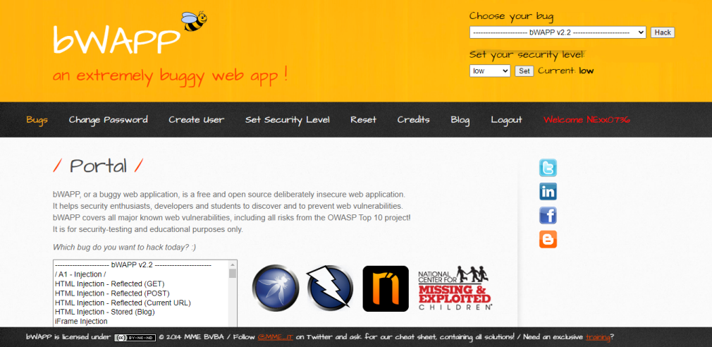

ขั้นตอนที่ 2 : เลือก "Cross-Site Scripting - Reflected (JSON)" ที่หัวข้อ Choose your bug จากนั้นกดปุ่ม "Hack"
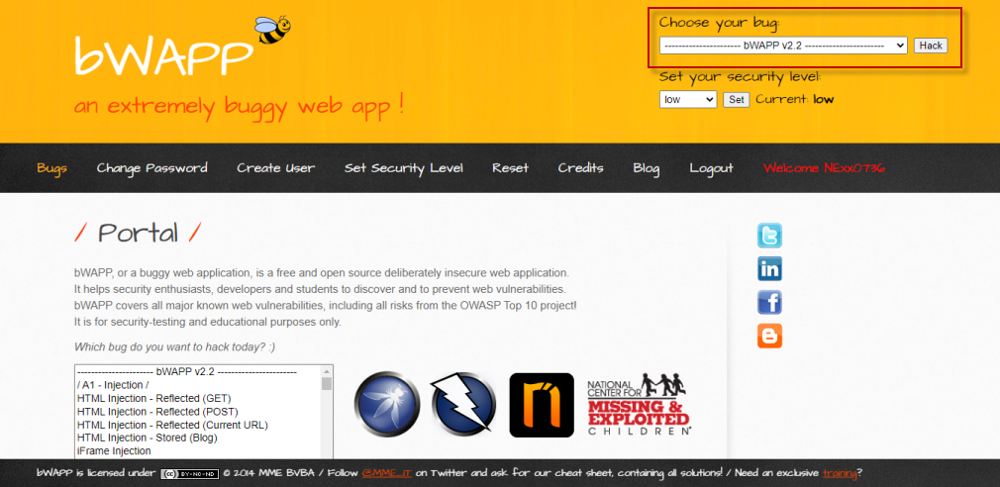

ขั้นตอนที่ 3 : ทดสอบการใช้งานตามฟังก์ชั่นปกติ
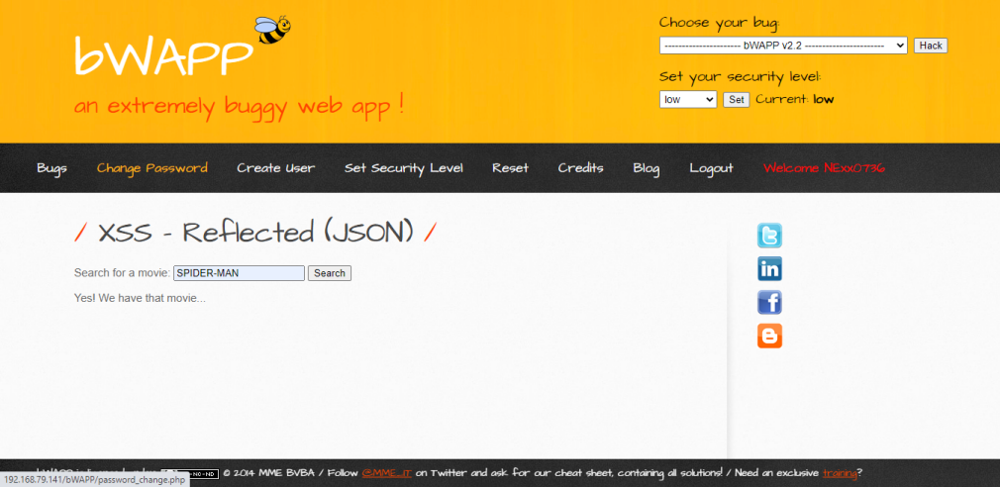

ขั้นตอนที่ 4 : ใช้ RIPS ที่ติดตั้งไว้แล้ว สแกนช่องโหว่ของ Code จากผลลัพธ์ตามรูปภาพ มี 1 ช่องโหว่ ที่เป็น "Cross-Site Scripting"
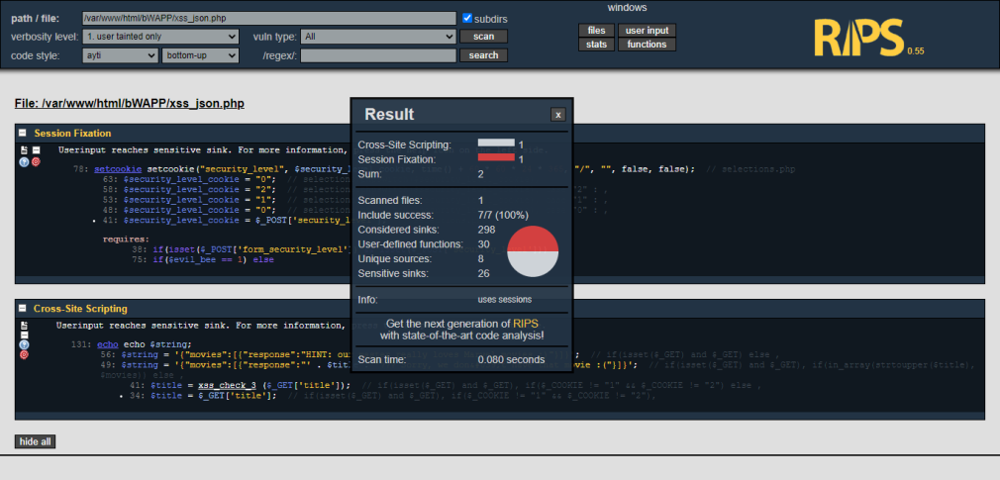

ขั้นตอนที่ 5 : ตรวจสอบบรรทัดที่ 131 ของ Code ที่มีช่องโหว่ (ตามรูปภาพ)
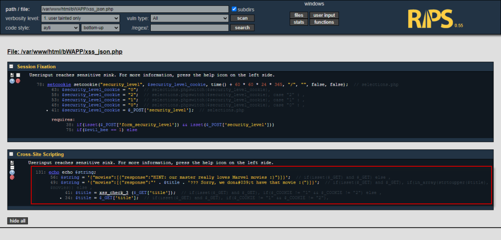

ขั้นตอนที่ 6 : กดปุ่ม "get help" เพื่อดูรายละเอียดของช่องโหว่ รวมถึงเลือก Securing Functions เพื่อมาแก้ไขช่องโหว่ดังกล่าว สำหรับบทความนี้เลือก "Highlight_string"
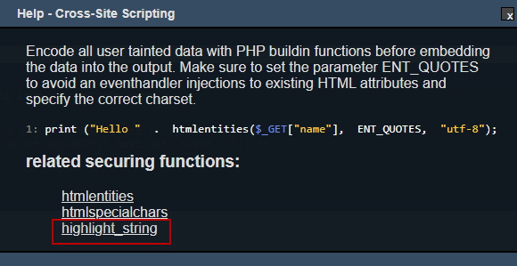

ขั้นตอนที่ 7 : กดลิงค์ "Highlight_string" เพื่อดูตัวอย่างการใช้ Securing Functions จาก www.php.net
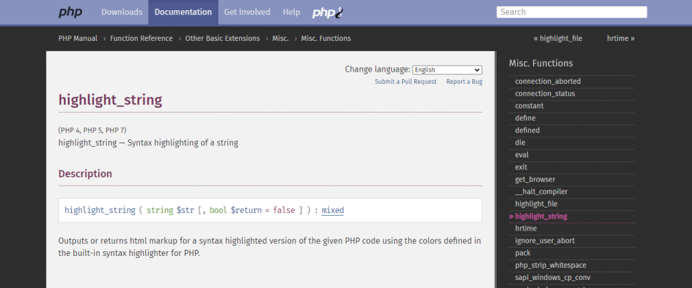

ขั้นตอนที่ 8 : ทำการเพิ่ม Securing Functions ตามคำแนะนำของ www.php.net
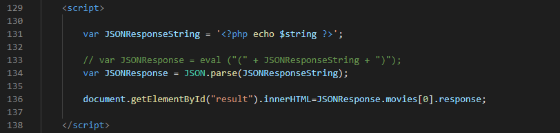
Code เดิม

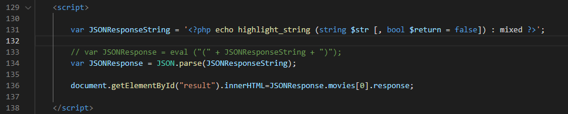
Code แก้ไขแล้ว

ขั้นตอนที่ 9 : ใช้ RIPS สแกนช่องโหว่ของ Code อีกครั้ง
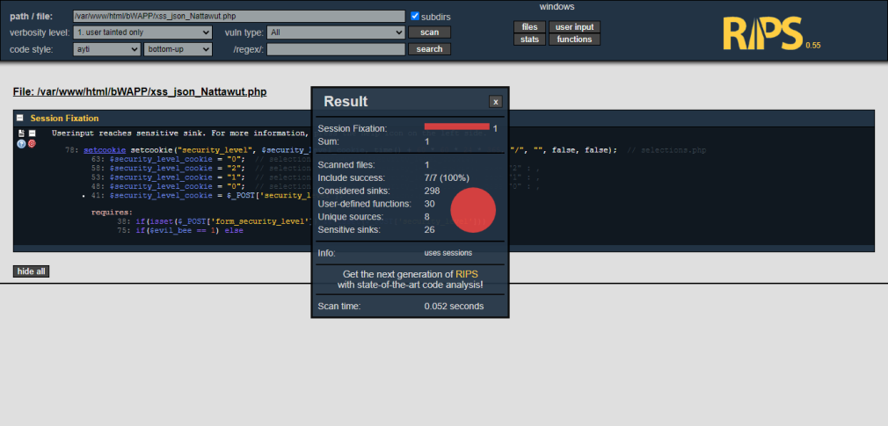

ขั้นตอนที่ 10 : ตรวจสอบการใช้งานตามฟังก์ชั่นปกติอีกครั้ง เพื่อให้แน่ใจว่าสามารถทำงานได้ตามปกติ
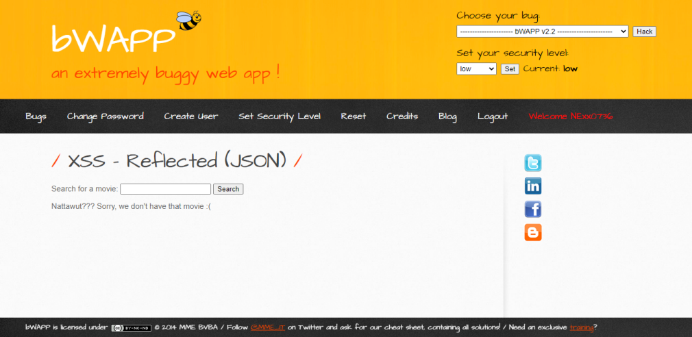

--------------------------------------

### Nattawut Reungsap